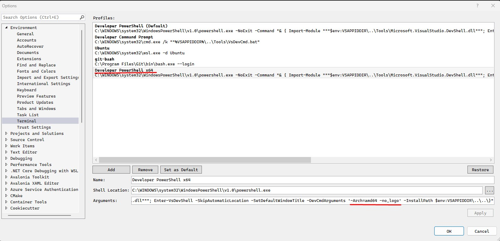
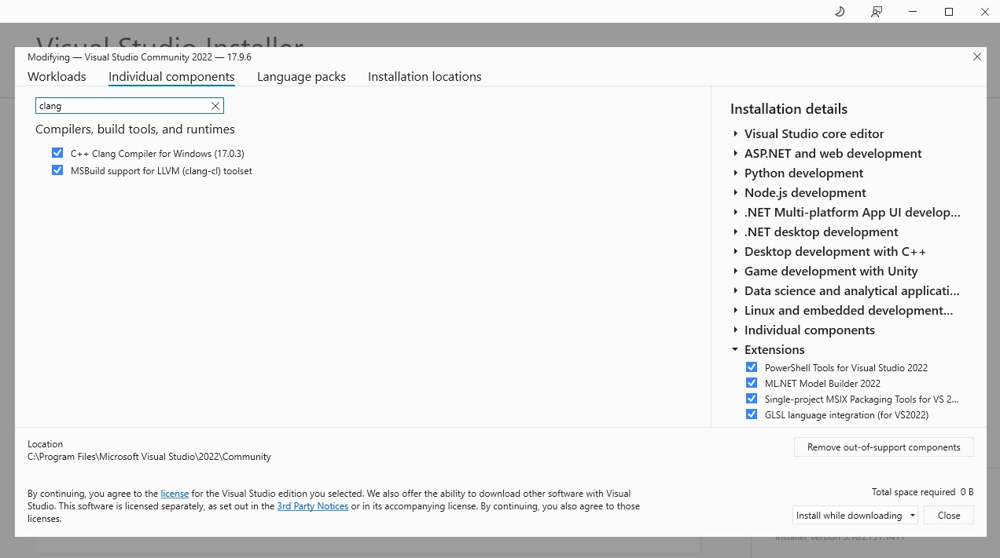

# Build or install depemdencies

Note: when in windows commands are run using [git-bash](https://git-scm.com/downloads) terminal.

## Install vcpkg

When on windows [set up vcpkg](https://learn.microsoft.com/en-us/vcpkg/get_started/get-started?pivots=shell-cmd) inside `/c/bin/` folder. 

```
> cd /c/bin
> git clone https://github.com/microsoft/vcpkg.git
> cd vcpkg
> ./bootstrap-vcpkg.bat
```

## Install libuv

When on windows install `uv` library using `vcpkg`

```
> /c/bin/vcpkg/vcpkg install libuv:x64-windows
```
## Ensure MS Visual Studio Community powershell terminal has x64 build environment set

[For more info see](https://learn.microsoft.com/en-us/visualstudio/ide/reference/command-prompt-powershell?view=vs-2022)

In MS Visual Studio Community open powershell terminal and verify by looking in lib paths that x64 build traget is set (normally by default is set x86 target).

```
PS> $env:LIB
C:\Program Files\Microsoft Visual Studio\2022\Community\VC\Tools\MSVC\14.39.33519\ATLMFC\lib\x86;C:\Program Files\Microsoft Visual Studio\2022\Community\VC\Tools\MSVC\14.39.33519\lib\x86;C:\Program Files (x86)\Windows Kits\NETFXSDK\4.8\lib\um\x86;C:\Program Files (x86)\Windows Kits\10\lib\10.0.22621.0\ucrt\x86;C:\Program Files (x86)\Windows Kits\10\\lib\10.0.22621.0\\um\x86
PS C:\w2\avocado_build>
```

If x64 target is not set define new powershell terminal having x64 target set. 



Ensure that `-DevCmdArguments '-Arch=amd64 -no_logo'` is in iterminal Arguments input field:

```
-NoExit -Command "& { Import-Module """$env:VSAPPIDDIR\..\Tools\Microsoft.VisualStudio.DevShell.dll"""; Enter-VsDevShell -SkipAutomaticLocation -SetDefaultWindowTitle -DevCmdArguments '-Arch=amd64 -no_logo' -InstallPath $env:VSAPPIDDIR\..\..\}"
```

## Ensure MS Visual Studio Community has clang compiler installed

Open MS Visual Studio Installer  and verify that clang is installed.




## Build Micro websockets

[also see](https://github.com/uNetworking/uWebSockets/actions/runs/8217383674/workflow)

### Windows

Clone the [repository](https://github.com/uNetworking/uWebSockets.git) inside the project root.


```
> git clone --recursive https://github.com/uNetworking/uWebSockets.git
```

Build `uWebSockets`, when on windows open project root folder in  MS Visual Studio Community open  powershel terminal x64 and run:

```
PS C:\w2\avocado> cd .\uWebSockets\
PS C:\w2\avocado\uWebSockets> ..\scripts\uWebSockets_build.ps1

```

### Linux

Clone the [repository](https://github.com/uNetworking/uWebSockets.git) inside the project root.


```
> git clone --recursive https://github.com/uNetworking/uWebSockets.git
```

Build uWebSockets:

```
~/w2/avocado> cd uWebSockets
~/w2/avocado/uWebSockets> make
```


